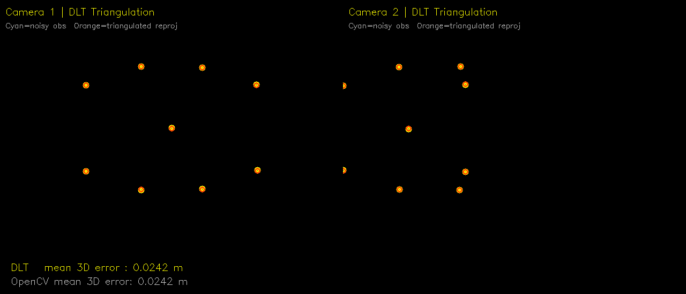
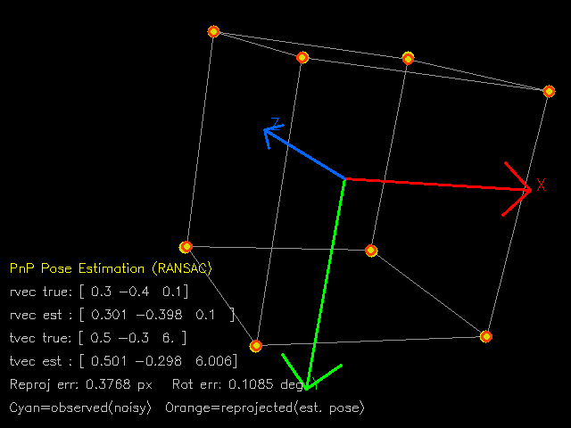
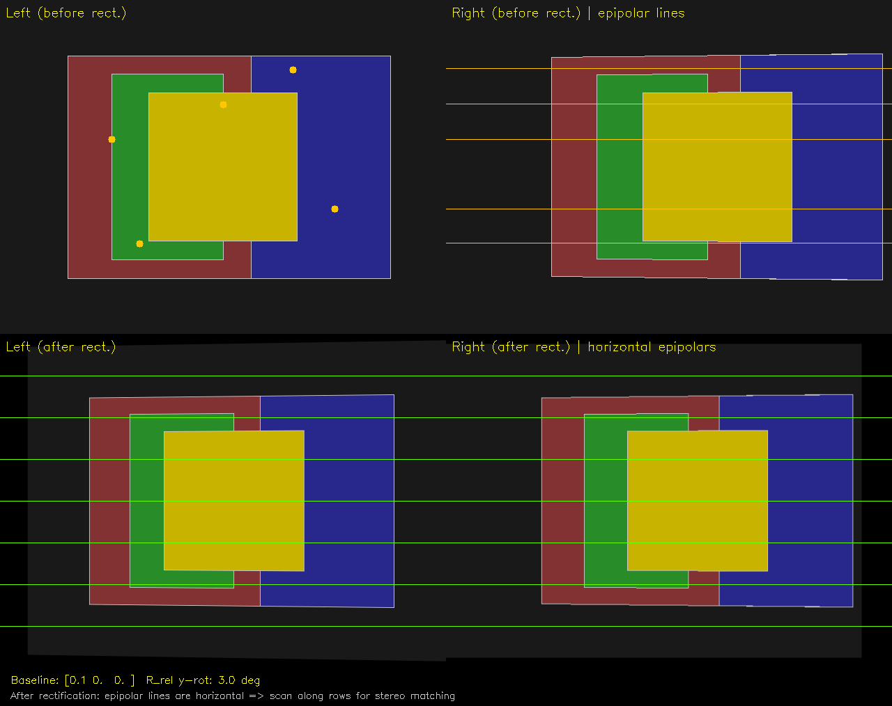
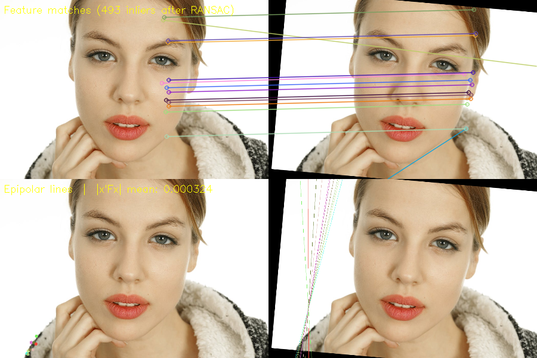
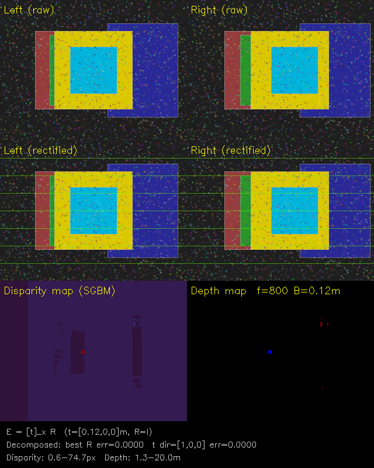

# 12주차 - Epipolar Geometry (에피폴라 기하학)

**Industrial Computer Vision** | CBNU Intelligent Systems & Robotics  
강의자: Youngbae Hwang | 2026.05.26

---

## 목차

1. [Triangulation (삼각측량)](#1-triangulation-삼각측량)
2. [Epipolar Geometry (에피폴라 기하학)](#2-epipolar-geometry-에피폴라-기하학)
3. [Essential Matrix (본질 행렬)](#3-essential-matrix-본질-행렬)
4. [Fundamental Matrix (기본 행렬)](#4-fundamental-matrix-기본-행렬)
5. [8-Point Algorithm](#5-8-point-algorithm)
6. [3D 복원 절차](#6-3d-복원-절차)
7. [Stereo Rectification (스테레오 정류)](#7-stereo-rectification-스테레오-정류)
8. [Stereo Block Matching (스테레오 블록 매칭)](#8-stereo-block-matching-스테레오-블록-매칭)
9. [연습문제 및 실전문제](#9-연습문제-및-실전문제)

---

## 1. Triangulation (삼각측량)

### 개념

두 개 이상의 카메라에서 동일한 3D 점 **X**를 촬영했을 때,  
각 카메라의 2D 관측값 **x₁**, **x₂** 와 카메라 행렬 **P₁**, **P₂** 로부터  
원래의 3D 좌표 **X** 를 역산하는 문제이다.

```
Camera 1 (P₁)          Camera 2 (P₂)
     |                       |
     x₁ ← ——— X ——— → x₂
```

### Backprojection (역투영)

2D 점 **x** 로부터 3D 상의 광선(ray)을 복원하는 과정.

- 카메라 중심 **C** 를 구하고
- **P** 의 유사역행렬(pseudo-inverse) **P⁺** 를 **x** 에 적용하여 광선 위의 한 점을 구한다
- 두 점을 이으면 3D 광선이 생성된다

$$\mathbf{X} = \mathbf{P}^+ \mathbf{x} + \lambda \mathbf{C}$$

### 왜 두 광선이 정확히 교차하지 않는가?

실제 측정에는 노이즈가 있기 때문에 두 광선은 공간에서 **정확히 교차하지 않는다**.  
따라서 **최소자승해(least-squares solution)** 를 구해야 한다.

### DLT (Direct Linear Transform) 방법

**핵심 아이디어**: 동차 좌표계에서 `x × (PX) = 0` (같은 방향의 벡터의 외적은 0)

투영 관계식 `x ~ PX` 를 동차 좌표로 쓰면 같은 방향이지만 스케일이 다를 수 있다.  
이 스케일 인수를 제거하기 위해 **외적(cross product)** 을 활용한다.

$$\mathbf{x} \times (P\mathbf{X}) = \mathbf{0}$$

이를 전개하면, 한 쌍의 2D-3D 대응점에서 **2개의 선형 방정식** 을 얻는다:

| 카메라 | 방정식 수 |
|--------|----------|
| Camera 1 (x₁, P₁) | 2개 |
| Camera 2 (x₂, P₂) | 2개 |
| **합계** | **4×4 시스템** |

이를 행렬 형태로 정리하면:

$$A\mathbf{X} = \mathbf{0}, \quad A \in \mathbb{R}^{4 \times 4}$$

여기서 A의 각 행은:

```
행 1: x₁·P₁[2] - P₁[0]       ← Camera 1, x 좌표
행 2: y₁·P₁[2] - P₁[1]       ← Camera 1, y 좌표
행 3: x₂·P₂[2] - P₂[0]       ← Camera 2, x 좌표
행 4: y₂·P₂[2] - P₂[1]       ← Camera 2, y 좌표
```

### SVD로 해 구하기

동차 선형 시스템 `AX = 0` 의 해는 **A의 SVD에서 가장 작은 특이값에 해당하는 우특이벡터**:

$$A = U \Sigma V^T \quad \Rightarrow \quad \mathbf{X} = \text{마지막 열의 } V$$

정규화: 동차 좌표의 마지막 원소로 나누어 3D 좌표를 복원한다.

```python
_, _, Vt = np.linalg.svd(A)
X = Vt[-1]          # 가장 작은 특이값의 우특이벡터
X = X[:3] / X[3]   # 동차 → 비동차 좌표
```

---

## 2. Epipolar Geometry (에피폴라 기하학)

### 기본 용어

```
                    X (3D 점)
                   /|\
                  / | \
                 /  |  \
               C₁   |   C₂
              /     |     \
            x₁    baseline   x₂
         (이미지1)          (이미지2)
```

| 용어 | 정의 |
|------|------|
| **Baseline (기준선)** | 두 카메라 중심 C₁, C₂ 를 잇는 선 |
| **Epipole (에피폴)** | 다른 카메라 중심을 현재 이미지 평면에 투영한 점 (`e` = projection of C₂ onto image 1) |
| **Epipolar Plane (에피폴라 평면)** | 3D 점 X, 두 카메라 중심 C₁, C₂ 로 결정되는 평면 |
| **Epipolar Line (에피폴라 선)** | 에피폴라 평면과 이미지 평면의 교선 |

### Epipolar Constraint (에피폴라 제약)

왼쪽 이미지의 점 **x** 에 대응하는 점이 오른쪽 이미지에서 **에피폴라 선** 위에 존재해야 한다는 조건.

> **핵심 효용**: 2D 전체 이미지를 탐색하는 대신 **1D 에피폴라 선만 탐색**하면 되므로 계산 비용이 대폭 감소한다.

### 카메라 배치에 따른 에피폴 위치

**수렴형 카메라 (Converging cameras)**:
- 에피폴이 이미지 내부 또는 외부에 존재
- 에피폴라 선이 에피폴에서 방사상으로 뻗어 나옴

**평행 카메라 (Parallel cameras)**:
- 두 카메라의 광축이 평행 → 에피폴이 **무한대** 에 위치
- 에피폴라 선이 **수평선** (Horizontal lines)
- → 스테레오 비전의 이상적인 배치

---

## 3. Essential Matrix (본질 행렬)

### 정의

**E**는 **카메라 좌표계**로 표현된 정규화된 2D 점들 사이의 에피폴라 제약을 인코딩하는 3×3 행렬.

> 가정: 두 카메라의 내부 파라미터 행렬 K가 단위행렬(identity)이거나 이미 제거된 상태.

$$\tilde{\mathbf{x}}'^T E \tilde{\mathbf{x}} = 0 \quad \text{(Longuet-Higgins 방정식)}$$

여기서 `x̃ = K⁻¹x` (카메라 좌표계의 정규화된 점).

### 구조

$$E = [\mathbf{t}]_\times R$$

- **R**: 두 카메라 사이의 회전 행렬
- **[t]ₓ**: 이동벡터 **t** 의 반대칭(skew-symmetric) 행렬

$$[\mathbf{t}]_\times = \begin{bmatrix} 0 & -t_z & t_y \\ t_z & 0 & -t_x \\ -t_y & t_x & 0 \end{bmatrix}$$

### E 행렬의 성질

| 성질 | 수식 |
|------|------|
| 에피폴라 선 (이미지 2) | `l' = Ex` |
| 에피폴라 선 (이미지 1) | `l = E^T x'` |
| 에피폴 (이미지 2) | `Ee = 0` → e는 E의 우 영공간(right null space) |
| 에피폴 (이미지 1) | `E^T e' = 0` → e'는 E의 좌 영공간(left null space) |
| 랭크 | `rank(E) = 2` |

### Essential Matrix vs Homography 비교

| | Essential Matrix | Homography |
|---|---|---|
| 크기 | 3×3 | 3×3 |
| 입력 → 출력 | **점 → 선** (에피폴라 선) | **점 → 점** |
| 필요 조건 | 일반 3D 장면 | 평면 장면 또는 순수 회전 |

### E 행렬로부터 R, t 복원

E를 SVD 분해하면 4가지 후보 (R, t) 가 나온다:

$$E = U \Sigma V^T \quad \Rightarrow \quad R \in \{UWV^T, UW^TV^T\}, \quad \mathbf{t} \in \{+U_3, -U_3\}$$

양의 깊이(Z > 0) 조건을 만족하는 해를 선택한다 (`cv2.decomposeEssentialMat`).

---

## 4. Fundamental Matrix (기본 행렬)

### 동기

Essential Matrix는 카메라 내부 파라미터(K)가 알려진 경우에만 사용 가능.  
**Fundamental Matrix F** 는 **픽셀 좌표계**에서 직접 동작하도록 E를 일반화한 행렬.

$$F = K'^{-T} E K^{-1} = K'^{-T} [\mathbf{t}]_\times R K^{-1}$$

### 에피폴라 제약 (픽셀 좌표)

$$\mathbf{x}'^T F \mathbf{x} = 0$$

여기서 **x**, **x'** 는 픽셀 좌표의 동차 벡터.

### F 행렬의 성질

| 성질 | 수식 |
|------|------|
| 에피폴라 선 (이미지 2) | `l' = Fx` |
| 에피폴라 선 (이미지 1) | `l = F^T x'` |
| 에피폴 (이미지 2) | `Fe = 0` (F의 우 영공간) |
| 에피폴 (이미지 1) | `F^T e' = 0` (F의 좌 영공간) |
| 랭크 | `rank(F) = 2` |
| 자유도(DoF) | 7 (스케일 불변, 랭크-2 제약으로 9-1-1=7) |

### E와 F의 관계

$$E = K'^T F K$$

K가 알려진 경우 F로부터 E를 구해 R, t를 복원할 수 있다.

---

## 5. 8-Point Algorithm

### 필요 대응점 수

- 각 대응점 쌍 (x, x')은 **에피폴라 제약**에서 **1개의 스칼라 방정식** 을 제공한다.
- F는 9개의 원소를 가지지만 스케일 불변이므로 실질적으로 **8개의 자유도**를 가진다.
- 따라서 최소 **8쌍의 대응점** 이 필요하다.

> **비교**: 호모그래피 추정에서는 각 대응점이 2개의 방정식을 주므로 최소 4점이 필요하다.

### 알고리즘 단계

```
Step 0. (선택) 점 좌표 정규화 (Normalization)
        - 평균을 원점으로, 평균 거리를 √2 로 맞춤
        - 수치 안정성 향상

Step 1. M×9 행렬 A 구성
        - 각 대응점 (x, x')으로부터 1행 생성:
          [x'x·xx, x'x·xy, x'x, x'y·xx, x'y·xy, x'y, xx, xy, 1]

Step 2. SVD(A) 수행
        A = U Σ V^T

Step 3. F의 원소 = V의 마지막 열 (가장 작은 특이값에 해당)
        f = V[:, -1].reshape(3, 3)

Step 4. (필수) 랭크-2 제약 강제
        F = U' diag(σ₁, σ₂, 0) V'^T
        → F의 SVD에서 가장 작은 특이값을 0으로 설정

Step 5. (Step 0 수행 시) 역정규화
        F = T'^T · F · T
```

### 에피폴 계산

에피폴 **e** 는 F의 **우 영공간(right null space)** 에 해당:

$$F\mathbf{e} = \mathbf{0}$$

→ F의 SVD에서 **가장 작은 특이값에 해당하는 우특이벡터** 가 에피폴이다.

```python
_, _, Vt = np.linalg.svd(F)
epipole = Vt[-1]          # 마지막 행 (가장 작은 특이값)
epipole = epipole / epipole[2]  # 정규화
```

### OpenCV 구현

```python
F, mask = cv2.findFundamentalMat(pts1, pts2, cv2.FM_8POINT)
# 또는 RANSAC 사용 (노이즈에 강인)
F, mask = cv2.findFundamentalMat(pts1, pts2, cv2.FM_RANSAC, ransacReprojThreshold=1.0)

# 에피폴라 선 계산
lines = cv2.computeCorrespondEpilines(pts1.reshape(-1,1,2), 1, F)
```

---

## 6. 3D 복원 절차

F 행렬을 알면 다음 단계로 3D 복원이 가능하다:

```
Step 1. 이미지 1에서 점 선택
Step 2. F를 사용해 이미지 2에서 에피폴라 선 계산: l' = Fx
Step 3. 에피폴라 선을 따라 최적 매칭 점 탐색 (특징 매칭 또는 주사선 스캔)
Step 4. 삼각측량(Triangulation)으로 3D 좌표 복원
```

**한계**:
- 수동 점 선택의 어려움
- 에피폴라 선 위에서의 정확한 매칭 어려움
- 노이즈로 인한 3D 재구성 오차

---

## 7. Stereo Rectification (스테레오 정류)

### 시차(Disparity)와 깊이(Depth)의 관계

평행 스테레오 카메라 배치에서:

$$d = x_L - x_R = \frac{f \cdot B}{Z}$$

| 변수 | 의미 |
|------|------|
| `d` | 시차 (Disparity) [픽셀] |
| `f` | 초점 거리 (Focal length) [픽셀] |
| `B` | 기준선 거리 (Baseline) [m] |
| `Z` | 깊이 (Depth) [m] |

> **핵심**: 시차는 깊이에 **반비례** 한다. 가까운 물체는 시차가 크고, 먼 물체는 시차가 작다.

$$Z = \frac{f \cdot B}{d}$$

### 스테레오 정류란?

두 이미지 평면을 **카메라 중심을 잇는 선에 평행한 공통 평면**으로 재투영하는 과정.

**정류 전**: 에피폴라 선이 기울어져 있음 → 매칭 탐색이 2D 전체에서 이루어짐  
**정류 후**: 에피폴라 선이 **수평** → 같은 행(row)만 탐색하면 됨

```
정류 전                     정류 후
┌──────────┐  ┌──────────┐   ┌──────────┐  ┌──────────┐
│  /       │  │   \      │   │ ─────    │  │  ─────   │
│ /  X     │  │    X \   │   │     X    │  │      X   │  ← 같은 행!
│/         │  │       \  │   │ ─────    │  │  ─────   │
└──────────┘  └──────────┘   └──────────┘  └──────────┘
  이미지1       이미지2         이미지1(정류)   이미지2(정류)
```

### 정류 알고리즘 (Loop & Zhang, CVPR 1999)

각 카메라에 대해 **3×3 단응사상(Homography)** 을 하나씩 계산:

```
Step 1. 우측 카메라를 R만큼 회전
        → 두 카메라 좌표계의 방향을 정렬

Step 2. 좌측 카메라를 회전 (정류)
        → 에피폴이 무한대로 이동 (에피폴라 선이 수평이 됨)

Step 3. 우측 카메라를 회전 (정류)
        → 에피폴이 무한대로 이동

Step 4. 스케일 조정
        → 두 이미지의 해상도 일치
```

### OpenCV 구현

```python
# 보정된 스테레오 카메라 (K, dist, R, T 알려진 경우)
R1, R2, P1, P2, Q, roi1, roi2 = cv2.stereoRectify(
    K1, dist1, K2, dist2, imageSize, R, T,
    flags=cv2.CALIB_ZERO_DISPARITY, alpha=0
)

# 정류 맵 생성
map1x, map1y = cv2.initUndistortRectifyMap(K1, dist1, R1, P1, imageSize, cv2.CV_32FC1)
map2x, map2y = cv2.initUndistortRectifyMap(K2, dist2, R2, P2, imageSize, cv2.CV_32FC1)

# 정류 적용
img1_rect = cv2.remap(img1, map1x, map1y, cv2.INTER_LINEAR)
img2_rect = cv2.remap(img2, map2x, map2y, cv2.INTER_LINEAR)
```

```python
# K를 모르는 경우 (F와 대응점만 있을 때)
H1, H2, _ = cv2.stereoRectifyUncalibrated(pts1, pts2, F, imageSize)
img1_rect = cv2.warpPerspective(img1, H1, imageSize)
img2_rect = cv2.warpPerspective(img2, H2, imageSize)
```

### 스테레오 깊이 추정 전체 파이프라인

```
1. 이미지 정류 (에피폴라 선을 수평으로)
2. 각 픽셀에 대해:
   a. 에피폴라 선(같은 행) 찾기
   b. 행을 스캔하며 최적 매칭 찾기
   c. 시차 d = x_L - x_R 계산
3. 깊이 Z = f·B/d 로 변환
```

---

## 8. Stereo Block Matching (스테레오 블록 매칭)

### 기본 원리

정류된 이미지에서 **에피폴라 선(수평선)** 을 따라 창(window)을 슬라이딩하며  
참조 이미지의 블록과 가장 유사한 블록을 탐색한다.

```
Left Image              Right Image
┌─────────────┐         ┌─────────────┐
│   [  블록  ] │ ──────> │ [  ?  ]     │ ← 같은 행에서 탐색
└─────────────┘         └─────────────┘
      참조 창                    주사선 스캔 →
```

### 유사도 측정 함수

| 방법 | 수식 | 특성 |
|------|------|------|
| **SAD** (Sum of Absolute Differences) | `Σ|I_L(x,y) - I_R(x+d,y)|` | 빠름, 노이즈에 민감 |
| **SSD** (Sum of Squared Differences) | `Σ(I_L(x,y) - I_R(x+d,y))²` | SAD보다 이상값(outlier)에 강 |
| **Zero-mean SAD** | `Σ|I_L-μ_L - (I_R-μ_R)|` | 밝기 오프셋에 불변 |
| **Locally scaled SAD** | 지역 스케일 정규화 후 SAD | 밝기 스케일 변화에 강인 |
| **NCC** (Normalized Cross-Correlation) | `Σ(I_L-μ_L)(I_R-μ_R) / (σ_L·σ_R)` | 밝기 변화에 가장 강인, 느림 |

> 성능 순서 (일반적): NCC > Zero-mean SAD > SSD > SAD

### 창 크기(Window Size)의 영향

| | 작은 창 (W=3) | 큰 창 (W=20) |
|---|---|---|
| 장점 | 세밀한 경계 표현 | 부드러운 시차맵 |
| 단점 | 노이즈에 민감 | 경계 부근 실패, 세부 손실 |

### 블록 매칭 실패 사례

1. **텍스처 없는 영역 (Textureless regions)**: 단색 벽, 하늘 등 → 유사도 구분 불가
2. **반복 패턴 (Repeated patterns)**: 체크무늬, 격자 등 → 잘못된 최적점 선택
3. **반사(Specularities)**: 정반사 물체 → 뷰포인트에 따라 외관이 달라짐

### Semi-Global Matching (SGM)

동적 프로그래밍(Dynamic Programming) 기반의 고급 스테레오 매칭 방법.

- 여러 방향(8방향 또는 16방향)에서의 에너지를 집계
- 블록 매칭보다 훨씬 정확하고 부드러운 시차맵 생성
- OpenCV: `cv2.StereoSGBM_create()`

```python
sgbm = cv2.StereoSGBM_create(
    minDisparity=0,
    numDisparities=96,   # 16의 배수
    blockSize=5,
    P1=8  * 3 * 5**2,   # 작은 불연속성 패널티
    P2=32 * 3 * 5**2,   # 큰 불연속성 패널티
    mode=cv2.STEREO_SGBM_MODE_SGBM_3WAY
)
disparity = sgbm.compute(gray_L, gray_R).astype(np.float32) / 16.0
depth = fx * baseline / disparity
```

---

## 9. 연습문제 및 실전문제

### 파일 구조

```
12/
├── lecture11.pdf                    # 강의 슬라이드
├── practice11_stereo_depth.py       # 실전문제: E 분해 + 시차맵
├── exercises/
│   ├── triangulation.py             # Ex1: 3D 삼각측량 (DLT/SVD)
│   ├── pnp_pose_estimation.py       # Ex2: PnP 포즈 추정
│   ├── stereo_rectification.py      # Ex3: 스테레오 정류
│   └── fundamental_matrix.py        # Ex4: 기본행렬 + 에피폴라선
└── output/
    ├── ex1_triangulation.png
    ├── ex2_pnp_pose_estimation.png
    ├── ex3_stereo_rectification.png
    ├── ex4_fundamental_matrix.png
    └── practice11_stereo_depth.png
```

---

### Ex1: 3D Triangulation — `exercises/triangulation.py`

**주제**: DLT(Direct Linear Transform)를 SVD로 구현하고 `cv2.triangulatePoints` 와 비교

**구현 내용**:
- 두 가상 카메라 (P₁, P₂) 설정 (카메라1: 원점, 카메라2: x축 2m 이동 + y축 5도 회전)
- 알려진 3D 점을 양 카메라에 투영 (노이즈 σ=1px 추가)
- 외적 기반 AX=0 시스템 구성 후 SVD로 해 계산 (DLT)
- `cv2.triangulatePoints` 결과와 평균 3D 오차 비교

**결과**:
- DLT 평균 3D 오차: **0.0242 m**
- OpenCV 평균 3D 오차: **0.0242 m** (동일한 알고리즘 사용)

```bash
cd 12/exercises && python3 triangulation.py
```



---

### Ex2: PnP Pose Estimation — `exercises/pnp_pose_estimation.py`

**주제**: 3D-2D 대응점으로부터 카메라 포즈(R, t) 복원

**구현 내용**:
- 단위 큐브(8점) + 좌표축(3점) = 11개의 3D 기준점 정의
- 알려진 포즈로 2D 관측점 생성 (노이즈 σ=1.5px)
- `cv2.solvePnPRansac` 으로 포즈 추정
- Rodrigues 벡터와 이동벡터를 진실값과 비교
- 재투영 오차 및 회전 오차(도 단위) 계산

**결과**:
- 재투영 오차: **0.3768 px**
- 회전 오차: **0.1085 도**
- rvec 진실 `[0.3, -0.4, 0.1]` → 추정 `[0.301, -0.398, 0.100]`

```bash
cd 12/exercises && python3 pnp_pose_estimation.py
```



---

### Ex3: Stereo Rectification — `exercises/stereo_rectification.py`

**주제**: 보정된 스테레오 카메라로 정류(Rectification) 전/후 비교

**구현 내용**:
- 가상 스테레오 카메라 설정 (K 공유, baseline=0.1m, 우측 카메라 y축 3도 회전)
- 4개의 3D 직사각형을 다양한 깊이(z=3~9m)에 배치하여 합성 장면 렌더링
- 이론적 F 행렬 (`F = K⁻ᵀ [t]ₓ R K⁻¹`) 계산 후 에피폴라 선 시각화
- `cv2.stereoRectify` + `cv2.initUndistortRectifyMap` 으로 정류 적용
- **정류 전**: 에피폴라 선이 기울어짐 → **정류 후**: 수평선으로 변환 확인

```bash
cd 12/exercises && python3 stereo_rectification.py
```



---

### Ex4: Fundamental Matrix — `exercises/fundamental_matrix.py`

**주제**: 실제 이미지에서 SIFT 매칭 → 8-점 알고리즘으로 F 계산 → 에피폴라 선 시각화

**구현 내용**:
- `face.jpeg` 를 좌측 이미지로 로드
- 알려진 호모그래피(5도 회전 + 40px 이동)로 합성 우측 이미지 생성
- SIFT 특징점 검출 및 BFMatcher + Lowe's ratio test(0.75)로 매칭
- `cv2.findFundamentalMat(FM_RANSAC)` 으로 F 계산
- 에피폴라 제약 검증: `|x'ᵀFx|` 평균 계산
- 컬러로 에피폴라 선 시각화 (좌측 점과 우측 에피폴라 선을 같은 색)

**결과**:
- SIFT 매칭: 513개 → RANSAC 인라이어: 493개 (96.1%)
- 에피폴라 제약 평균 오차 `|x'Fx|`: **0.000324** (≈ 0)

```bash
cd 12/exercises && python3 fundamental_matrix.py
```



---

### Practice: Stereo Depth Estimation — `practice11_stereo_depth.py`

**주제**: Essential Matrix 분해 → 스테레오 정류 → StereoSGBM 시차맵 → 깊이 변환

**구현 내용**:

1. **Essential Matrix 계산 및 분해**
   - `E = [t]ₓ R` (평행 스테레오: R=I, t=[B, 0, 0])
   - `cv2.decomposeEssentialMat(E)` → 4가지 (R, t) 후보 중 올바른 해 선택
   - R 복원 오차: **0.0000**, t 방향: `[1, 0, 0]` 오차 **0.0000**

2. **합성 스테레오 장면 렌더링**
   - z=2~12m 에 5개의 3D 직사각형 배치
   - 블록 매칭을 위한 랜덤 점 텍스처 추가

3. **스테레오 정류** (`cv2.stereoRectify`)
   - alpha=0.0: 블랙 테두리 없는 최대 ROI

4. **시차맵 추정** (`cv2.StereoSGBM_create`)
   - numDisparities=96, blockSize=5, SGBM_3WAY 모드

5. **시차 → 깊이 변환**
   - `Z = f × B / d` (f=800px, B=0.12m)

**결과**:
- E 분해 R 오차: **0.0000** (단위 행렬 완벽 복원)
- 시차 범위: **0.6 ~ 74.7 px**
- 깊이 범위: **1.0 ~ 20m** (유효 영역)

```bash
cd 12 && python3 practice11_stereo_depth.py
```



---

## 핵심 공식 요약

| 공식 | 설명 |
|------|------|
| `AX = 0` (SVD) | DLT 삼각측량의 선형 시스템 |
| `x'ᵀ E x = 0` | 에피폴라 제약 (카메라 좌표계) |
| `x'ᵀ F x = 0` | 에피폴라 제약 (픽셀 좌표계) |
| `E = [t]ₓ R` | Essential Matrix 구조 |
| `F = K'⁻ᵀ E K⁻¹` | F와 E의 관계 |
| `l' = Fx` | 점 x에 대한 에피폴라 선 계산 |
| `Fe = 0` | F의 우 영공간 = 에피폴 |
| `d = f·B/Z` | 시차-깊이 관계 |
| `Z = f·B/d` | 깊이 복원 공식 |

---

## 참고 문헌

- C. Loop and Z. Zhang, *"Computing Rectifying Homographies for Stereo Vision"*, CVPR 1999
- H. C. Longuet-Higgins, *"A computer algorithm for reconstructing a scene from two projections"*, Nature 1981
- R. Hartley and A. Zisserman, *"Multiple View Geometry in Computer Vision"*, Cambridge 2003

## 관련 OpenCV 함수

```python
cv2.triangulatePoints(P1, P2, pts1, pts2)           # 삼각측량
cv2.solvePnPRansac(obj_pts, img_pts, K, dist)        # PnP 포즈 추정
cv2.findFundamentalMat(pts1, pts2, method)           # F 행렬 계산
cv2.computeCorrespondEpilines(pts, which_img, F)     # 에피폴라 선
cv2.decomposeEssentialMat(E)                         # E → R, t
cv2.stereoRectify(K1, d1, K2, d2, size, R, T)        # 스테레오 정류
cv2.initUndistortRectifyMap(K, d, R, P, size, type)  # 정류 맵 생성
cv2.remap(img, map1, map2, interpolation)             # 정류 적용
cv2.StereoSGBM_create(...)                           # SGM 시차 추정
```
