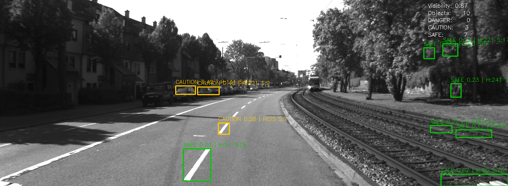
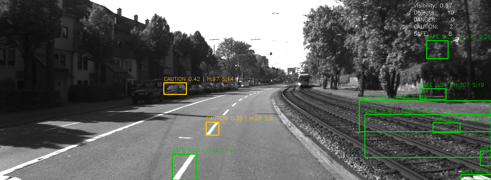
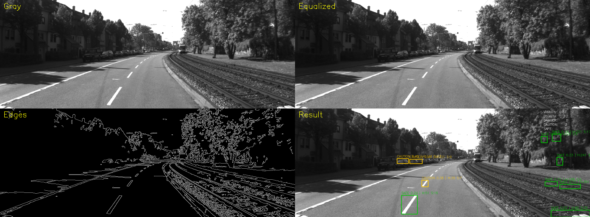
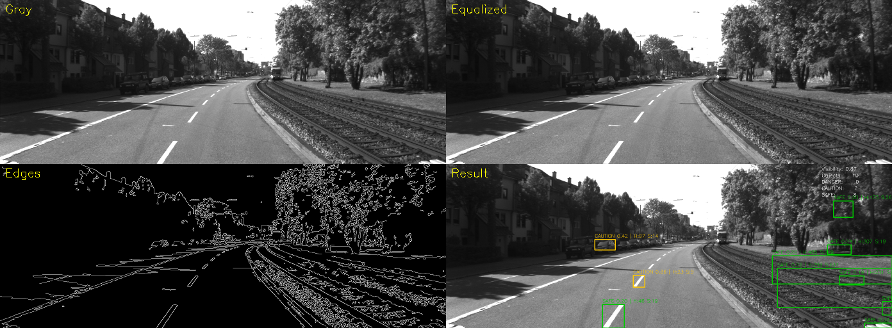

# 단안 카메라 기반 전방 위험 객체 탐지 및 위험도 등급화

---

## 프로젝트 핵심 목적

### 문제 정의

자율주행 및 ADAS(첨단 운전자 보조 시스템) 분야에서 전방 위험을 실시간으로 감지하는 것은 핵심 과제입니다. 그러나 고가의 LiDAR나 스테레오 카메라 없이 **단안 카메라 하나만으로** 전방 위험을 판단할 수 있을까요?

### 목표

> 딥러닝 없이, 단안 카메라 영상만으로 전방 위험 객체를 탐지하고 위험도를 자동 등급화한다.

- 별도 학습 데이터 없이 **순수 영상처리 기법만** 사용
- 강의 3~7주차에서 배운 기법을 하나의 시스템으로 통합
- 실시간 처리가 가능한 경량 파이프라인 구현

### 핵심 가정

| 가정 | 근거 |
|------|------|
| 객체가 클수록 가까이 있다 | 원근법 — 거리가 가까울수록 이미지 내 면적이 커짐 |
| 정면에 있을수록 위험하다 | 직진 시 화면 중앙에 있는 물체와 충돌 확률이 가장 높음 |
| 시인성이 낮을수록 더 위험하다 | 야간/역광 환경에서는 반응 시간이 줄어들어 동일 거리도 더 위험 |

---

## 파이프라인

```
입력 이미지
    │
    ▼
[1] 전처리 (preprocessing.py)
    - Grayscale 변환
    - 히스토그램 기반 시인성 점수 계산 (Lec 3)
    - 시인성 낮을 시 Histogram Equalization 적용 (Lec 3)
    - Gaussian Blur 노이즈 제거 (Lec 4)
    - Canny Edge Detection (Lec 6)
    │
    ▼
[2] 객체 검출 (detection.py)
    - Morphology + Contour 기반 검출 (Lec 5/6)
    - 검출 실패 시 Otsu + Connected Component 보조 검출 (Lec 5/6)
    - 차량/보행자 크기 필터 (하늘 영역, 노이즈 제거)
    │
    ▼
[3] 특징점 추출 (feature.py)
    - 각 객체 ROI 내 Harris Corner 수 계산 (Lec 7)
    - 각 객체 ROI 내 SIFT 키포인트 수 계산 (Lec 7)
    │
    ▼
[4] 위험도 평가 (risk.py)
    - 크기 점수 (객체 면적 / 이미지 면적)
    - 중앙 거리 점수 (화면 중심과의 거리)
    - 시인성 가중치 (낮을수록 위험도 최대 1.3배 증가)
    - SAFE / CAUTION / DANGER 3단계 분류
    │
    ▼
[5] 시각화 (visualize.py)
    - 바운딩 박스 + 위험도 레이블 + Harris/SIFT 수치 표시
    - 우측 HUD (시인성, 객체 수, 등급별 카운트)
    - DANGER 탐지 시 경고 배너 + 중앙선 강조
```

---

## 실행 결과

### 탐지 결과 (바운딩 박스 + 위험도 + HUD)

| 프레임 1 | 프레임 2 |
|----------|----------|
|  |  |

- 초록 박스: **SAFE** — 안전 거리
- 노랑 박스: **CAUTION** — 주의
- 빨강 박스: **DANGER** — 위험
- 우측 상단 HUD: 시인성 점수, 등급별 객체 수
- 각 박스 위: `등급 점수 | H:Harris수 S:SIFT수`

### 디버그 패널 (`--debug` 옵션)

| 프레임 1 | 프레임 2 |
|----------|----------|
|  |  |

4분할 구성: **Gray** (좌상) → **Equalized** (우상) → **Edges** (좌하) → **Result** (우하)

---

## 강의 연계 — 개념과 역할

### Lec 3 — 히스토그램 & 시인성 평가

**개념**
이미지의 픽셀 밝기값(0~255) 분포를 히스토그램으로 분석합니다.
히스토그램 평탄화(Equalization)는 밝기가 특정 구간에 몰려 있을 때 전체 범위로 고르게 펴서 대비를 높입니다.

**프로젝트 역할**
```
밝기 평균이 128에서 멀수록(야간/역광) → 시인성 점수 낮음
밝기 표준편차가 클수록(대비 풍부)     → 시인성 점수 높음
시인성 < 0.5 → Histogram Equalization 자동 적용
```
이후 엣지 검출이 잘 되도록 이미지를 보정하고, 시인성 점수는 최종 위험도 계산에 가중치로 활용됩니다.

---

### Lec 4 — 이미지 필터링

**개념**
필터(커널)는 주변 픽셀값을 가중 평균하여 새 픽셀값을 결정하는 행렬입니다.
Gaussian 필터는 중심에 가까울수록 높은 가중치를 부여해 자연스러운 블러 효과를 내며 고주파 노이즈를 제거합니다.

**프로젝트 역할**
```
노이즈가 있는 이미지 → Canny 적용 시 잡음도 엣지로 검출
Gaussian Blur 선적용 → 실제 객체 경계만 남도록 준비
```

---

### Lec 5 — 컨투어 & Connected Component

**개념**
- 컨투어(Contour): 이진 이미지에서 같은 밝기값으로 이어진 경계선의 좌표 목록
- Connected Component: 서로 연결된 픽셀 덩어리에 번호를 붙이고 위치/크기 통계를 반환

**프로젝트 역할**
- 컨투어: Canny 엣지에서 차량 윤곽선을 추출 → 바운딩 박스 계산
- Connected Component: 컨투어 검출 실패 시 Otsu 이진화 후 픽셀 덩어리 단위로 객체 탐색

---

### Lec 6 — 엣지 검출 & 세그멘테이션

**개념**
- Canny Edge: Gaussian → Sobel 기울기 → NMS → 이중 임계값 순으로 처리해 얇고 정확한 경계선 추출
- Otsu Thresholding: 히스토그램을 분석해 전경/배경을 가장 잘 나누는 임계값을 자동 결정
- Morphology Close/Dilate: 끊어진 엣지를 이어붙이고 경계를 팽창시켜 Contour가 잘 잡히도록 처리

**프로젝트 역할**
```
Canny Edge → Morphology Close → Dilate → Contour 추출
끊어진 차량 윤곽선 → 하나의 덩어리 → 바운딩 박스
```

---

### Lec 7 — 특징점 추출

**개념**
- Harris Corner: x/y 방향 모두 밝기 변화가 큰 지점(코너)을 검출. 단순 배경보다 구조가 복잡한 영역에서 많이 나타남
- SIFT: 크기/회전에 불변한 특징점. 주변 밝기 패턴을 128차원 벡터로 표현

**프로젝트 역할**
```
검출된 객체 ROI 내 Harris/SIFT 수치 계산
→ 특징점이 많을수록 구조가 복잡한 객체(차량, 보행자)일 가능성 높음
→ HUD에 보조 지표로 표시
```

---

## 객체 감지 상세

### 핵심 아이디어

> 물체의 경계는 밝기가 급격히 변한다. 밝기 변화가 큰 곳(엣지)을 찾고, 그 엣지로 둘러싸인 덩어리를 객체로 인식한다.

### 1단계: Canny Edge + Contour (주 검출)

```
Canny Edge 결과
    │
    ▼
Morphology Close (구멍 메우기, 3×3 커널 2회)
    │
    ▼
Dilate (윤곽 팽창, 1회)
    │
    ▼
findContours (외곽선 추출)
    │
    ▼
차량 크기 필터 적용 → 면적 상위 10개 반환
```

### 2단계: Otsu + Connected Component (보조 검출)

1단계에서 아무것도 검출되지 않을 때만 실행됩니다.

```
Grayscale 이미지
    │
    ▼
Otsu Thresholding (자동 이진화, 반전)
    │
    ▼
상단 30% 하늘 영역 제거
    │
    ▼
connectedComponentsWithStats (연결된 픽셀 덩어리 분석)
    │
    ▼
차량 크기 필터 적용 → 면적 상위 10개 반환
```

### 공통: 차량 크기 필터

| 조건 | 이유 |
|------|------|
| 면적 > 이미지의 0.1% | 노이즈 제거 |
| 면적 < 이미지의 15% | 도로/배경 제거 |
| 가로 < 이미지 너비의 70% | 도로 구분선 제거 |
| 세로 ≥ 15px | 얇은 수평선 제거 |
| y 위치 > 이미지 높이의 30% | 하늘 영역 제거 |

### 객체 감지 한계

- 객체와 배경의 대비가 낮으면 엣지가 잘 안 잡힘
- 겹친 차량은 하나의 덩어리로 인식될 수 있음
- 클래스 구분 없음 (차량인지 보행자인지 알 수 없음)

---

## 위험도 판단 상세

### 핵심 아이디어

> 단안 카메라는 거리를 직접 측정할 수 없다. "크기가 크면 가깝다", "정면에 있으면 위험하다" 는 원근법 원리를 수식으로 표현한다.

### 구성 요소

**1. 크기 점수 (size_score) — 50% 비중**

```
size_score = min(객체 면적 / (이미지 면적 × 0.08), 1.0)
```

객체 면적이 화면의 8% 이상이면 score = 1.0. 객체가 클수록 카메라에 가까이 있다고 판단합니다.

**2. 중앙 거리 점수 (center_score) — 50% 비중**

```
dx = (객체 중심 x - 화면 중심 x) / (화면 너비 / 2)
dy = (객체 중심 y - 화면 중심 y) / (화면 높이 / 2)

dist_norm    = sqrt(dx² + dy²) / sqrt(2)    # 0.0(중앙) ~ 1.0(모서리)
center_score = 1.0 - dist_norm
```

정중앙에 있을수록 score = 1.0. `sqrt(2)` 로 나누는 이유는 대각선 끝점까지의 거리를 1.0으로 정규화하기 위함입니다.

**3. 시인성 가중치 (vis_weight) — 최대 1.3배 증폭**

```
vis_weight = 1.0 + 0.3 × (1.0 - visibility_score)
```

| 시인성 | 가중치 | 상황 |
|--------|--------|------|
| Good (≥ 0.6) | 1.00 ~ 1.12 | 맑은 낮 |
| Moderate (0.35 ~ 0.6) | 1.12 ~ 1.20 | 흐린 날, 황혼 |
| Poor (< 0.35) | 1.20 ~ 1.30 | 야간, 역광, 안개 |

### 최종 계산

```
score = (크기점수 × 0.5 + 중앙거리점수 × 0.5) × 시인성가중치
```

### 위험도 기준

| 레벨 | 점수 범위 | 색상 | 의미 |
|------|----------|------|------|
| SAFE | 0.00 ~ 0.35 | 초록 | 안전 거리 확보 |
| CAUTION | 0.35 ~ 0.60 | 노랑 | 주의 필요 |
| DANGER | 0.60 ~ 1.00 | 빨강 | 즉각 위험 |

### 위험도 판단 한계

실제 거리를 측정하지 않고 **"크기가 크면 가깝다"** 는 가정에 의존합니다. 실제로 큰 트럭이 멀리 있어도 DANGER로 분류될 수 있으며, 스테레오 카메라나 LiDAR 없이는 이 한계를 극복하기 어렵습니다.

### 딥러닝 기반 방법과의 비교

| 항목 | 이 프로젝트 | YOLO 등 딥러닝 |
|------|------------|----------------|
| 거리 측정 | 면적으로 추정 | 단안 동일하게 불가 |
| 클래스 구분 | 없음 | 차/사람/신호등 구분 |
| 속도 추정 | 없음 | 트래킹으로 추정 가능 |
| 정확도 | 낮음 | 높음 |
| 원리 이해 | 수식으로 명확 | 블랙박스 |
| 학습 데이터 | 불필요 | 대규모 필요 |

---

## 디렉토리 구조

```
Midterm_exam/
├── README.md
├── src/
│   ├── main.py            # 진입점, 이미지 루프 및 통계 출력
│   ├── preprocessing.py   # 전처리 파이프라인 및 시인성 평가
│   ├── detection.py       # 객체 검출 (Contour / Connected Component)
│   ├── feature.py         # 특징점 추출 (Harris, SIFT)
│   ├── risk.py            # 위험도 등급화
│   └── visualize.py       # 결과 시각화
├── dataset/               # 입력 이미지 디렉토리
└── output/                # 저장된 결과 이미지 (--save 옵션 시 생성)
```

---

## 권장 데이터셋

### 1순위: KITTI Vision Benchmark (권장)
- 사이트: https://www.cvlibs.net/datasets/kitti/
- 해상도: 1242×375 (좌측 컬러 카메라)
- 이유: 코드의 차량 크기 필터와 면적 임계값이 KITTI 기준으로 튜닝되어 있어 별도 조정 없이 최적 결과
- 권장 세트: **Object Detection** 또는 **Raw Data** 의 도심/고속도로 시퀀스

### 2순위: BDD100K (다양한 환경 테스트)
- 사이트: https://bdd-data.berkeley.edu/
- 해상도: 1280×720
- 이유: 주간/야간/우천 등 다양한 시인성 조건 포함 → 시인성 가중치 로직 검증에 적합
- 주의: 해상도가 달라 크기 필터 임계값 소폭 조정 필요

### 3순위: 직접 촬영 영상
- 전방 블랙박스 또는 스마트폰 영상에서 프레임 추출
- `ffmpeg -i video.mp4 -vf fps=5 frames/%04d.png` 로 추출 가능
- 주의: 카메라 앵글이 다르면 하늘 영역 제거 비율(0.30) 조정 필요

---

## 실행 방법

```bash
cd src

# 기본 실행
python3 main.py

# 전처리 디버그 패널 표시 (4분할 화면)
python3 main.py --debug

# 결과 이미지 output/ 에 저장
python3 main.py --save

# 처음 50장만 처리
python3 main.py --max 50

# 데이터셋 경로 직접 지정
python3 main.py --data ../dataset
```

### 키 조작

| 키 | 동작 |
|----|------|
| 오른쪽 화살표 / `d` | 다음 프레임 |
| 왼쪽 화살표 / `a` | 이전 프레임 |
| `s` | 현재 프레임 저장 |
| `q` | 종료 |

---

## 의존성

```bash
pip install opencv-python numpy
```
